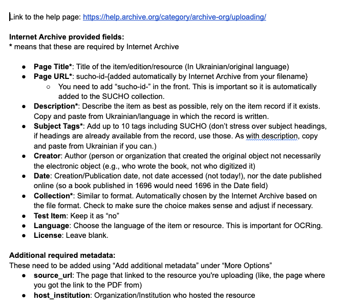

While we are encouraging everyone to submit [file links to the Wayback Machine](ia-gsheets) or use [Browsertrix](browsertrix) to capture files, we realize that sometimes it's not possible to do so, whether because there are too many links to manually record or because there are too many errors with the URL syntax.

So here are instructions for doing bulk upload to IA. There's two main ways to do it:

1. Using the `internetarchive` Python library to upload files to IA.
2. Using the `internetarchive` command line interface tool to upload files to IA.

For those unsure how to use either, feel free to ask for help in either the `#internetarchive` or `#scraping` channels.

Before jumping into the bulk upload process, please make sure to take a look at our metadata template for IA, available in Slack (not linking here to avoid trolls). That template outlines the majority of how you should organize your metadata and will be the basis for the bulk upload.

All the info about the IA API can be found at [https://archive.org/services/docs/api/index.html](https://archive.org/services/docs/api/index.html) and the first step is to configure your API key.


### Configuring your Setup

Installation instructions for the Python library can be found [https://archive.org/services/docs/api/internetarchive/installation.html](<https://archive.org/services/docs/api/internetarchive/installation.html>), and they are pretty comprehensive, but reach out if you have issues installing. Same goes for the CLI installation instructions [https://archive.org/services/docs/api/internetarchive/cli.html](<https://archive.org/services/docs/api/internetarchive/cli.html>).

First step is to configure your credentials, which you can do with the `internetarchive` Python library.

```python
from internetarchive import configure
configure('user@example.com', 'password')
```

Copy the above code and replace `user@example.com` with your Archive.org username and `password` with your password.

Or you can do it with the CLI tool [https://archive.org/services/docs/api/internetarchive/quickstart.html#configuring](https://archive.org/services/docs/api/internetarchive/quickstart.html#configuring) with the following code:

```sh
$ ia configure
Enter your archive.org credentials below to configure 'ia'.

Email address: user@example.com
Password:

Config saved to: /home/user/.config/ia.ini
```

Once this is done you should see a message like that final line though it may be `/home/user/.config/internetarchive/ia.ini` depending if you configured with the Python library. Both of them are just indicating where your credentials are now stored in your local computer.

More details on configuration options are available in the API docs [https://archive.org/services/docs/api/internetarchive/api.html#module-internetarchive](https://archive.org/services/docs/api/internetarchive/api.html#module-internetarchive) (including things like session tokens, etc.).

Now we are ready to start uploading but first you need to get your metadata and files organized.

### Metadata and Files

In the Google Doc metadata template (if you don't have it, please ask for help on Slack), you'll see the following fields as being required for the SUCHO collection:



We need to enter the same data for the bulk upload, but some of the IA API do not have the same field names, so we need to map them accordingly.

Specifically:

- Page Title becomes `title`
- Page URL becomes `identifier`
- Subject Tags becomes `subject` (though there's some specifics with the `subject` field that I'll explain)

The rest stay the same though all field names are lowercased and use underscores for spaces, so you'll also need `description`, `source_url`, and `host_institution`. Ideally, I would also recommend submiting `creator`, `date`, `language`, and `publisher` as well.

Here's my sample metadata for one of the files I've uploaded:

```python
{
    'title': 'Бандуристе орле сизий (обробка дуету "Бандурна розмова") Бандура 2 / Banduryste orle syzyy (obrobka duetu "Bandurna rozmova") Bandura 2', 
    'remote_filepath': 'ArticleFiles_1258.pdf', 
    'identifier': 'sucho-id-ArticleFiles_1258', 
    'description': 'через http://library.dudaryk.ua/ua/compositions/~Banduryste_orle_syzyy_Bandura_2 / from http://library.dudaryk.ua/en/compositions/~Banduryste_orle_syzyy_Bandura_2 \n\nЖанр:  ансамблевий, солоспіви, українські народні пісні\nСтоліття:  XIX-XX\nОбрядовий рік:  інше\nЛітургія:  \n\nJenre:  Ensemble music, Solo singing, Ukrainian folk songs\nCentury:  XIX-XX\nCeremonial Year:  Others\nWorship Services:  \n\n\n\nвказано під листом: Б / listed under letter: B \nдодаткові URL-адреси | additional urls: \nhttp://library.dudaryk.ua/ua/compositions?articles_p=15 / http://library.dudaryk.ua/en/compositions?articles_p=30 \nhttp://library.dudaryk.ua/php_uploads/data/articles/ArticleFiles_1258.pdf \n', 
    'source_url': 'http://library.dudaryk.ua/ua/compositions/~Banduryste_orle_syzyy_Bandura_2', 
    'creator': nan, 
    'subject[0]': 'SUCHO', 
    'subject[1]': 'Dudaryk Choir Music Library', 
    'subject[2]': 'composition', 
    'subject[3]': 'choir music', 
    'publisher': 'Saving Ukrainian Cultural Heritage Online (SUCHO.org)', 
    'language': 'ukr', 
    'collection': 'opensource', 
    'host_institution': 'Dudaryk Choir Music Library', 
    'license': nan, 
    'local_filepath': './articles/ArticleFiles_1258.pdf'
}
```

Because the site I scrapped had both Ukrainian and English versions, I combined those fields for the relevant files. I also added in some `\n` characters to make the text a little more readable in description. You can see the uploaded file here <https://archive.org/details/sucho-id-ArticleFiles_1258>. This is just one example and not meant to be definitive.

You'll also notice that my subject field requires using this `subject[0]` syntax. We have no specified subject tags at the moment, but I would highly recommend at the very least including the `SUCHO` tag. For each tag you add, you'll need to add a new `subject[X]` field. Also if you don't know the language, feel free to leave it blank but it is useful for OCR purposes to specify the language.

While I'm showing the metadata as a Python dictionary, you'll actually want to store in a CSV file (or a dataframe if working with Pandas). I've uploaded an example of this data as a CSV file [here](./assets/files/sample_collection.csv) for reference.

### Uploading

When uploading, the most important thing is to make sure that your filepaths are correct and that your identifier starts with `sucho-id-`. In this example, I used the `local_filepath` field to indicate where these files were stored on my computer, and then the `remote_filepath` to specify how the filepath should look on the IA interface. You do not need to use that same logic, you could just have the files as a list of filenames, but do make sure that the your filenames correspond to how you want them to appear on the remote site.

Say we were working with our `sample_collection.csv` as a dataframe then with the `internetarchive` Python library, you can upload files with the following command:

```python
# First configure your session
from internetarchive import configure
configure('user@example.com', 'password')

# Load in your csv
import pandas as pd
df = pd.read_csv('sample_collection.csv')

# Upload files using upload functionality
from internetarchive import upload

for index, row in df.iterrows():
    f = upload(
        identifier=row['identifier'],
        files={
            row['remote_filepath']: row['local_filepath']
        }, # or could do [row['local_filepath']]
        metadata=row[['title', 'description', 'source_url', 'creator', 'host_institution', 'publisher', 'language', 'collection', 'license', 'subject[0]', 'subject[1]', 'subject[2]', 'subject[3]']].to_dict(), #only selecting our metadata fields
    )
    print(r.status_code[0])
```

This should print out `200` for each file you upload. If you get a `40*` error, it likely means you've exceeded your upload limit. You can check your upload limit by logging into the IA interface and looking at your account page. You can also see if your file successfully uploaded on your user page (it usually takes a minute or two to upload).

You'll notice in this example I'm using a `for loop` rather than just a single upload. That's because bulk uploading is technically only available with the CLI tool, but you might want to loop through a dataframe the first few times you upload a file to make sure your metadata is correctly configured (though you may want to use the `time` library to delay your requests if you're a for loop using it for many files). Also if you do make a mistake in the metadata, as long as your identifier is correct you can just edit it in your user page and it will update the metadata for you. If the identifier is wrong, you'll need to contact the admins on Slack who will let you know if you should delete the file or if they can alter it for you.

To do the bulk upload with the CLI tool, we can reuse our `sample_collection.csv` file and just change the `local_filepath` to `file` and `remote_filepath` to `REMOTE_NAME`. More details are available on the API site <https://archive.org/services/docs/api/internetarchive/cli.html#upload>, including a sample csv file for the bulk upload. 

Now in our shell we just write:
```sh
ia upload --spreadsheet=sample_collection.csv
```
And our bulk upload should work!

You can name your csv whatever you want, but make sure to point the CLI tool to the right filepath.

There's a number of bulk upload specific commands (like `--retries` for trying to reupload the file if S3 is overloaded) that you can use to tweak the upload process, so definitely check out the API docs. But also feel free to ask questions in Slack.


